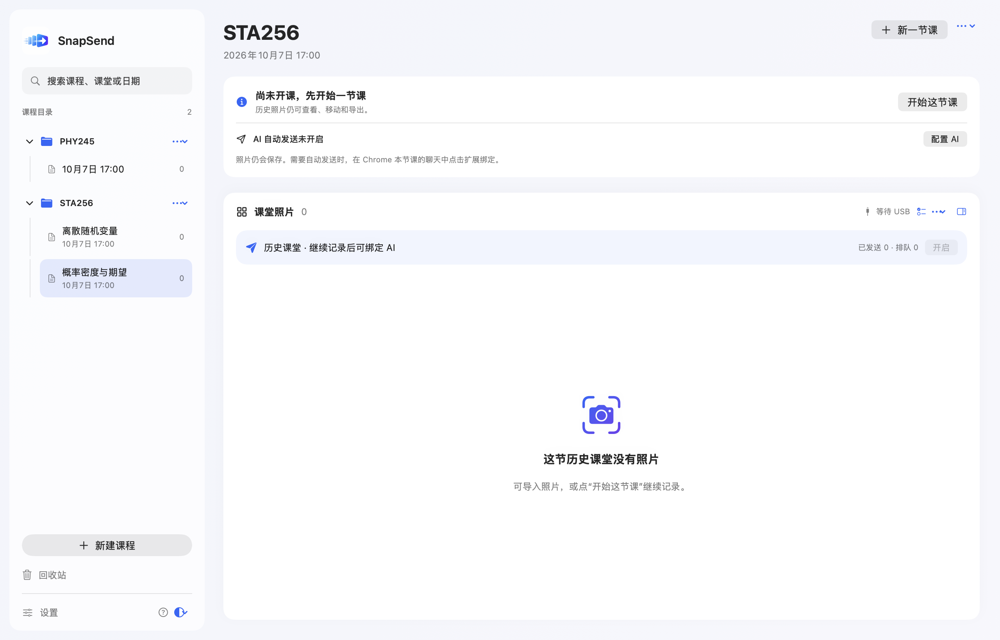

# SnapSend

**拍下课堂，留在本地，送到 AI。**

SnapSend 是 macOS + iPhone 的课堂拍照工具：手机确认照片后通过 USB 传到 Mac，按「课程 → 每次上课」保存。Chrome 扩展可把照片发送到你明确绑定的 ChatGPT 聊天。

手机到电脑不需要个人热点、校园网或云端中转。上传 ChatGPT 时，电脑仍需要联网。

> 当前为 **v0.5.0 预览版**。USB 和归档已在真机使用；自动投递依赖 ChatGPT 网页结构，最新版完整实发流程仍需持续验证。

## 下载

| 下载 | 内容 |
| --- | --- |
| [Mac App · Apple Silicon ZIP](https://github.com/Dos7t3r/SnapSend/releases/download/v0.5.0/SnapSend-Mac-arm64.zip) | Release 版 SnapSend.app，含本机桥接与插件 |
| **[Chrome 插件 · 独立 ZIP](https://github.com/Dos7t3r/SnapSend/releases/download/v0.5.0/SnapSend-Chrome-Extension.zip)** | 解压后在 Chrome 加载，无需下载整个源码 |
| [iOS 自签源码 ZIP](https://github.com/Dos7t3r/SnapSend/releases/download/v0.5.0/SnapSend-iOS-Source.zip) | iPhone 工程及共享代码，用自己的账号签名 |
| [所有版本与更新日志](https://github.com/Dos7t3r/SnapSend/releases) | 发布说明、下载文件和 SHA-256 校验清单 |

独立入口：[浏览器插件下载与安装页](downloads/README.md)。目前未上架 Chrome Web Store 或 App Store；不提供作者个人开发证书签名的公共 IPA。



## 功能

- **USB 传输**：首次六位验证码配对，记住设备后挑战验证，退避重连、照片 ID 去重。
- **课程目录**：可折叠课程/课堂、Mac 本地时间、搜索、改名、回收站恢复。
- **照片管理**：大图、批量选择、跨课堂移动、导出选中照片/整节课/整门课程。
- **手机相册**：按课堂分组、左右分页、双击/双指缩放、导出原图和重新传输。
- **ChatGPT 投递**：支持普通、项目和自定义 GPT 聊天，绑定明确标签页和 URL，后台队列发送。
- **课堂提示词**：开课和总结提示词可定制，提示词与照片排队，下课总结由用户触发。
- **操作提示**：分别说明能否拍照同步、能否发给 AI；阻塞时显示原因与下一步。
- **资源控制**：Release 构建、后台缩略图、缓存预算、增量状态更新和自适应检查。

## 安装与第一次使用

### Mac

1. 下载 Mac ZIP，解压，将 SnapSend.app 放在稳定位置，如「应用程序」。预编译包仅支持 Apple Silicon；Intel 可尝试源码构建，但未验证。
2. 在已安装 Homebrew 的电脑执行 `brew install libusbmuxd`。USB 代理未随包分发，App 检查 `/opt/homebrew/bin/iproxy` 与 `/usr/local/bin/iproxy`。
3. 打开 SnapSend。当前包采用 ad-hoc 签名，尚未 Apple 公证；如系统拦截，在「系统设置 → 隐私与安全性」确认来源后使用系统提供的打开入口。

### iPhone

1. 下载 iOS 源码 ZIP 或克隆仓库，在 Xcode 打开 `iOS/SnapSendPhone.xcodeproj`。
2. 登录自己的 Apple 账号，在 SnapSendPhone 目标的 Signing & Capabilities 选择 Team；首次安装设置唯一 Bundle Identifier。也可复制 `iOS/Signing.local.xcconfig.example` 为 `iOS/Signing.local.xcconfig` 并填写自己的 Team ID。
3. 插线、解锁、信任 Mac，按系统要求开启开发者模式；选择手机并点击 Run。开发签名到期需重新签名；更新已有安装时保留原 Bundle Identifier，避免卸载导致照片丢失。
4. 手机 App 保持前台。空闲时允许自动锁屏；锁屏/后台会暂停 USB 服务，回到 App 后重连。

### 课堂与配对

1. Mac 点「新建课程」，输入名字，自动创建第一节课并记录 Mac 本地时间。
2. 插线打开手机 App，Mac 点「连接手机」。首次输入手机六位验证码并记住设备；验证码 60 秒有效，最多三次错误尝试。
3. 手机显示当前课程后拍照。确认后原图先在手机落盘，再经 USB 保存到对应 Mac 课堂。
4. 后续在课程菜单点「新一节课」。浏览旧课堂不会改变正在记录的课堂；需要继续旧课时明确选择「继续记录此课堂」。

### Chrome 自动发送

1. Mac AI 设置选择 Chrome，点击「安装浏览器桥接」。App 移动位置后需重新安装桥接。
2. [下载独立插件 ZIP](https://github.com/Dos7t3r/SnapSend/releases/download/v0.5.0/SnapSend-Chrome-Extension.zip)，解压并保留整个文件夹。
3. Chrome 打开 `chrome://extensions` → 开发者模式 → 加载已解压的扩展程序 → 选择含 `manifest.json` 的目录。
4. 刷新 ChatGPT 页面，固定工具栏插件。打开本课专用的具体聊天，点插件并按面板提示绑定当前课堂与聊天。支持 `/c/<聊天>`、`/g/<项目或 GPT>/c/<聊天>`，项目首页不能绑定。
5. 按 Mac 的提示词/自动发送设置开启投递。插件显示就绪后，手机拍照确认即可；聊天标签页保持打开，正常后台发送不抢焦点。
6. 草稿、旧附件、AI 回答中或页面未接入时会等待。Mac 显示具体原因，可点「显示绑定聊天」检查。页面改版可能需要更新适配。
7. 结果待核对时先确认聊天是否收到，再在 Mac 选择「AI 已收到」或清理草稿后「重新排队」。切换课堂、重启应用/浏览器后重新确认绑定与发送。
8. 下课等待队列完成，再触发「发送下课总结」或复制总结提示词；结束课堂后仍可查看和导出归档。

更新插件：在扩展管理页重新加载，再刷新聊天。独立插件应与 Mac 版本匹配；manifest 内公开公钥用于固定扩展 ID，并非私钥，请勿修改。

## 数据与限制

- Mac 归档：`~/Library/Application Support/SnapSend/Prototype`；手机收到 Mac 接收回执后仍保留照片。
- 跨课堂移动只调整 Mac 归档，手机历史保持拍摄时课堂。回收站保留照片，单独删除照片需确认。
- USB/浏览器桥接只监听本机回环，不开放 LAN；长期凭据存在钥匙串，浏览器桥接使用随机本机 token。
- USB 媒体帧无额外应用层认证加密；暂无按字节断点续传，未确认照片整张重传并去重。
- Mac 保存原图；AI 上传副本最大边 2048 像素、约 680 KB，细字可能需补拍近景。
- 网页回执只表示页面确认图片消息，不能保证服务器侧 exactly-once 或 AI 已理解内容。异常会暂停等待核对。
- 网页通道目前仅支持 ChatGPT。原生 ChatGPT Mac App 通道为实验功能，需辅助功能权限且发送后需核对。
- 最低目标 macOS 14 / iOS 17；新玻璃效果按系统回退，旧系统与 Intel 尚未完成实机兼容性验证。

## 从源码构建与测试

需要支持 Swift 6 和新 SwiftUI SDK 的 Xcode。本次验证使用 macOS 26.7.1 / Xcode 27，iOS 27 模拟器。以下在仓库根目录运行：

```sh
zsh scripts/build-mac.sh
open build/SnapSend.app
```

```sh
swift test --scratch-path build/swift --cache-path build/cache --config-path build/config --security-path build/security --disable-sandbox
node --test Tests/Browser/*.test.cjs
```

iOS 模拟器（按本机设备名替换 destination）：

```sh
xcodebuild -project iOS/SnapSendPhone.xcodeproj -scheme GalleryTests -destination 'platform=iOS Simulator,name=iPhone 18 Pro Max' -derivedDataPath build/gallery-tests test CODE_SIGNING_ALLOWED=NO
```

16 项核心、37 项浏览器、4 项 iOS 模拟器测试通过；Mac Release 构建通过，iPhone Release 在一台 iPhone 15 Pro Max 覆盖安装并成功启动。模拟测试不能替代真实 AI 发图验收。真实续航、长时间内存和最新版完整 USB→AI 连续发送仍待验证。

500 条照片记录的 100 次状态更新专项测试约从 0.47 秒降到 0.03 秒，只衡量元数据路径，不能推断整体耗电。详见 [资源优化记录](docs/PERFORMANCE-UX.zh-CN.md)。

## 文档

- [CHANGELOG：版本日志](CHANGELOG.md)
- [插件独立下载](downloads/README.md)
- [发布校验与构建记录](docs/RELEASE-v0.5.0.zh-CN.md)
- [架构](docs/ARCHITECTURE.zh-CN.md) · [性能与流程](docs/PERFORMANCE-UX.zh-CN.md)
- [首次公开发布前的历史记录](docs/HISTORY.zh-CN.md)

## 许可证

[MIT License](LICENSE) · Copyright © 2026 Dos7t3r。SnapSend 是独立项目，与 OpenAI、Apple、Google 无官方关联。
