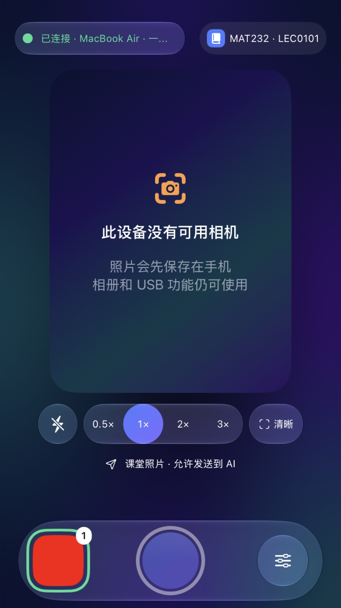
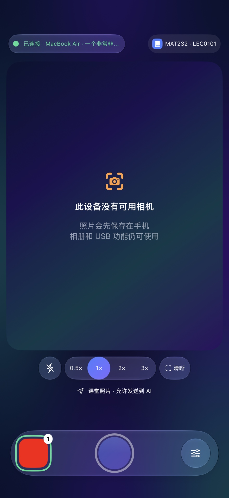

# 自动发送边界与等待恢复

本轮是在现有 USB、课堂归档和浏览器桥接上修复，不是另做上传工具。开发版本：Mac 0.6.0 build 9、手机 0.6.0 build 11、Chrome 扩展 0.6.1。尚未安装到用户设备或发布正式 Release。

## 找到的问题与新行为

原来 Mac 在自动发送关闭时仍把收到的课堂照片加入队列；再次开启会补排本课所有尚未发送的旧图。单张发送还会把持续自动发送打开，因此其余图片会跟着上传。

现在区分三种行为：

| 行为 | 会发送什么 |
|---|---|
| 开启自动发送 | 只自动排队开启后新收到、且允许发送的当前课堂照片；以前的排队图转为仅保存 |
| 只发送这一张 / 批量发送选中 | 暂停持续自动发送，只给指定 UUID 发一次投递授权；其他旧图与后来收到的图片不跟着发 |
| 手机拍摄前选“私人照片 · 仅保存” | 原图照常保存并通过 USB 归档，持久保存拒绝自动发送的选择；重启、重连、开启发送、重置队列不改变选择 |

已经开始上传或点击发送的图片不能撤销为“仅保存”，必须暂停并到 AI 核对。还在排队的照片，可以在 Mac 大图的“管理照片 → 仅保存，移出发送队列”处理。仅保存的图之后仍可由用户明确选中发送。

“仅保存”包含 Mac 本地归档，不是完全不传到电脑；它阻止的是上传 AI。旧手机未提供新协议字段时，仍按 Mac 开关决定自动排队；要在拍摄当时拒绝上传，需要更新手机 App。

数据沿用：每张图的 UUID 去重、SHA-256 校验、原子归档、提交前持久标记、发送结果不确定时暂停。手动一次授权不在重启后自动恢复，原图和队列记录保留。

## 网页不必靠刷新恢复

- AI 正在回答时不领取图片任务，退避到 15 秒检查一次；回答结束后重新检查并继续。不把“AI 没回复”当成照片发送失败：照片成功依据网页出现新的图片用户消息。
- 扩展提供“停止当前回答并继续”，只在用户点击后操作停止按钮，并再次确认当前标签页就是绑定聊天。不会定时擅自停止回答或切换聊天。
- 发送未确认时，先在 Mac 核对。已核对且没有正在投递的任务时，扩展允许释放自己的旧附件锁；只有输入框无草稿且附件已经被处理，才解除锁。不会删除用户附件、覆盖文字或自动重发不确定图片。
- 换错聊天、未识别输入框、桥接断开等仍给出对应提示。新安装扩展第一次刷新以注入脚本，和每次投递后被迫刷新是两件事。
- 扩展会明确显示“仅发送手动选中的图片”，不把单张授权伪装成持续自动发送开启。

## 原生桌面投递加固及限制

原生发送现在只查活动窗口，不扫描整个 App 的所有窗口；拒绝多个输入框或无法区分聊天的通用窗口标题。粘贴前、上传中、点击发送前都检查目标、窗口、前台焦点与暂停状态；正在打字时本次附图暂停，避免抢走输入。

辅助功能扫描最多 800 个节点、深度 18，上传检查按 0.5 秒 → 1 秒 → 2 秒退避，总等待有上限。保留剪贴板变化保护：用户更改剪贴板后不会被旧内容覆盖。原生 App 的消息送达回执仍不能确认，点击发送后仍要求人工核对，不自动重复发送。

当前电脑控制工具明确拒绝读取 `com.openai.codex` 自身界面，无法在这次会话里验收 Codex 的任务识别、输入框与附件显示。因此这只是通用原生通道加固，尚不是完成的 Codex 专用适配。只有通用“Codex”标题时会拒绝绑定，不能拿标题相同当成任务相同。后续需要可验证的任务身份和该版本的真实 UI 测试；不使用猜测坐标发送图片。

## 性能范围

保留已有手机后台编码、文件写入与 USB 串行队列；新增发送选择只是少量持久元数据。缩略图沿用 24MB / 48 张缓存上限，不引入常驻图库扫描。等待 AI 时减少桥接和页面检查；原生 App 限定窗口并减少全树扫描频率。

这些是明确的资源控制，不等于测得电池续航改善。真实 iPhone 相机、USB 课堂连续拍照和 Codex 投递能耗还需 Instruments / 活动监视器长时间测试。不能用构建时 CPU 或模拟器表现推断实际 App 耗电。

## 验证

2026 年 10 月 8 日验证；测试使用临时照片、模拟桥接和真实应用模型，没有向用户的 AI 聊天发送测试图片。

| 检查 | 实际结果 |
|---|---|
| 浏览器测试 | 46 项通过，覆盖回答结束恢复、明确停止、未确认附件保护和单次发送状态 |
| Swift 核心测试 | 27 项通过，覆盖仅保存持久化、队列重置及协议旧字段兼容 |
| Mac 真实 WorkspaceModel 集成 | 通过：暂停接收、开启不补发、私人图、新图、单张授权与归档恢复；完整列表滚动及隔离页面渲染通过 |
| iPhone Pro Max 模拟器 | 9 项通过，包含私人照片选择落盘、确认和重载 |
| iPhone SE 模拟器 | 拍摄布局测试通过，同一测试覆盖已连接、未连接、无目标、拒绝权限、相机未就绪 5 种状态 |
| Mac Release / iPhone Release | 两端构建成功；Mac ad-hoc 签名、手机个人开发签名成功，手机尚未覆盖安装 |

截图来自模拟数据，SE 和 Pro Max 的新增发送选择没有被 Dock 遮挡。占位画面不代表真机相机已验收。

| SE：375×667 | Pro Max：440×956 |
|---|---|
|  |  |

Mac 修复包实际启动后，未连接 USB、自动发送关闭、没有操作的短时空闲采样：16.07 秒内累计 CPU 时间增加约 0.01 秒（约 0.06% 单核时间）；RSS 约 21–24 MiB。另一次 3 秒调用栈取样显示主线程等待系统消息，内存 footprint 74.4 MiB。RSS 与 footprint 含义不同，不应互相代替。启动后最初看到的 `ps %CPU` 为 32–37%，后续实际 CPU 时间增量没有显示持续忙循环；这不是一节课的能耗测量，也未验证前台持续动效和 USB/AI 工作负载。

未验收：真实网页最终实发、真机私人照片 USB 全链路、Codex 原生任务识别与发送。需要按下方步骤在专用测试聊天验证；当前环境的电脑控制工具拒绝读取 Codex 自身，不能以通用桌面代码编译成功替代实测。iPad 目前只有方案，Share Extension 的 USB 生命周期与个人账号签名仍需独立原型验证。

## 更新后怎么试

1. 更新 Mac 与手机，Chrome 扩展页重新加载新版；刷新已有 ChatGPT 页面一次。
2. 开启自动发送，拍一张课堂图，应上传；切到“私人照片 · 仅保存”再拍一张，应在 Mac 出现但不上传。
3. 暂停发送，拍两张；再次开启，旧图应保持仅保存。再拍一张允许发送的新图，应只发送新图。
4. 在旧图的大图菜单点“只发送这一张”，其他图片不跟着发送，持续自动发送开关保持关闭。
5. 让 AI 回答结束，队列应继续；回答卡住时在扩展点“停止当前回答并继续”。待核对照片先去 Mac 核对，清理聊天草稿后点重新检查，不需要每次刷新。

iPad 分享扩展的设计、签名与资源验证顺序另见 [iPad 方案](IPAD-SHARE-DESIGN.zh-CN.md)，本轮未创建或安装 iPad App。
